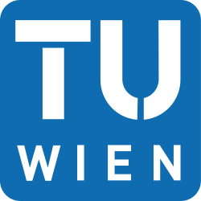
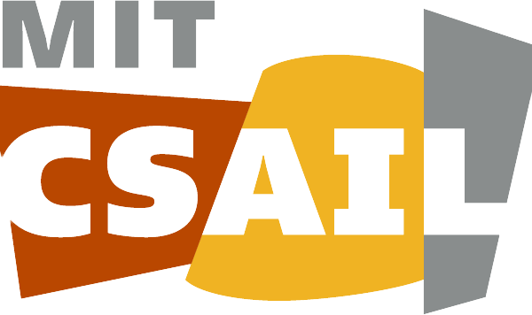
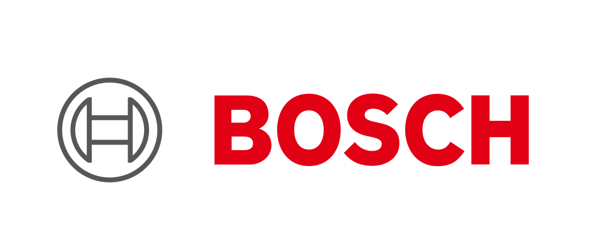
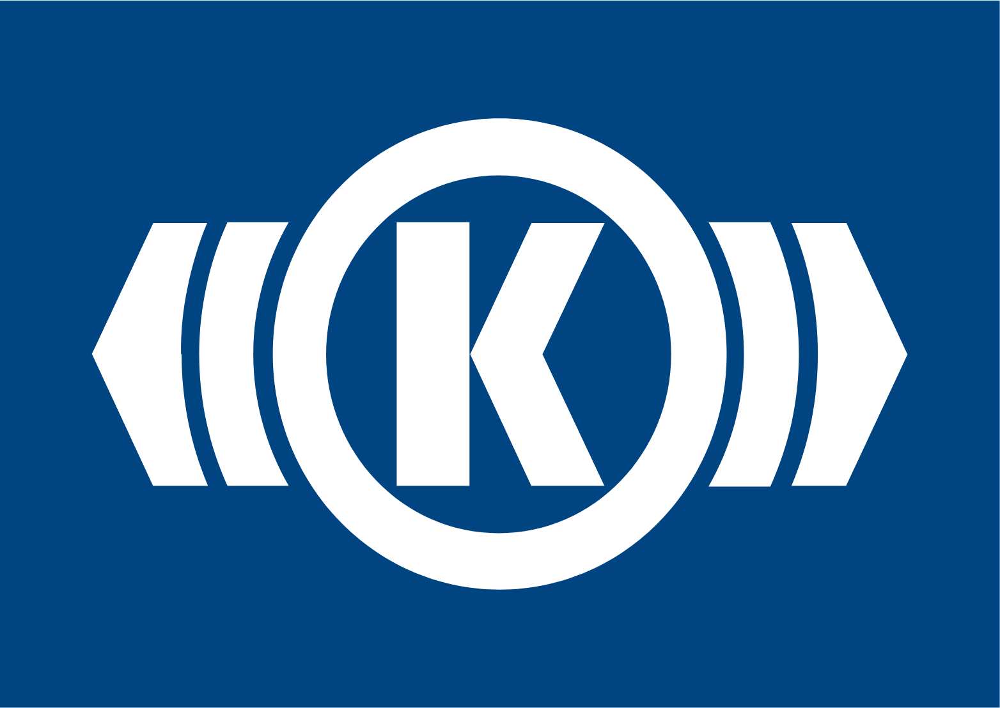

I am a PhD student in Computer Engineering at the Vienna University of Technology (TU Wien), co-supervised by Prof. Radu Grosu (TU Wien), Prof. Gerhard Schütz (TU Wien), and Prof. Daniela Rus (MIT). My research focuses on the interpretability of bio-inspired neural networks in robotics and autonomous systems. I work with architectures such as Neural Circuit Policies (NCPs) and Liquid Time-Constant Networks (LTCs), inspired by <em>C. elegans</em>, to enhance transparency and trust in AI decision-making while ensuring efficiency for real-world applications.

## Education & Experience

<table style="padding-top:30px;width:100%;max-width:800px;">
    <tbody>
        <tr style="border: none;">
            <td style="padding-top:0px;width:25%;vertical-align:middle;text-align:center;max-height:100px;border: none;">
              
            </td>
            <td style="padding-top:0px;width:25%;vertical-align:middle;text-align:center;max-height:100px;border: none;">
              
            </td>
            <td style="padding-top:0px;width:25%;vertical-align:middle;text-align:center;max-height:100px;border: none;">
              
            </td>
            <td style="padding-top:0px;width:25%;vertical-align:middle;text-align:center;max-height:100px;border: none;">
              
            </td>
          </tr>
          <tr style="border: none;background-color:transparent">
            <td style="font-size: small;padding-bottom:50px;padding-top:5px;width:25%;vertical-align:middle;text-align:center;border: none;">TU Wien 
              PhD student 
              07/2022-Present
            </td>
            <td style="font-size: small;padding-bottom:50px;padding-top:5px;width:25%;vertical-align:middle;text-align:center;border: none;">

              MIT CSAIL
     
              Visiting Researcher 
              09/2024-11/2024
            </td>
            <td style="font-size: small;padding-bottom:50px;padding-top:5px;width:25%;vertical-align:middle;text-align:center;border: none;">

              Microsoft Research
     
              Open Source Developer 
              04/2021-08/2021
            </td>
            <td style="font-size: small;padding-bottom:50px;padding-top:5px;width:25%;vertical-align:middle;text-align:center;border: none;">
Bosch 
              Software Developer Intern 
              06/2019-08/2021
</td>
          </tr>
          <tr style="border: none;">
            <td style="font-size: small;padding:0px;margin-bottom:-50px;width:25%;vertical-align:middle;text-align:center;border: none;">
              
            </td>
            <td style="font-size: small;padding:0px;margin-bottom:-50px;width:25%;vertical-align:middle;text-align:center;border: none;">
              
            </td>
            <td style="font-size: small;padding:0px;margin-bottom:-50px;width:25%;vertical-align:middle;text-align:center;border: none;">
              
            </td>
          </tr>
          <tr style="border: none;background-color:transparent">
            <td style="font-size: small;padding-bottom:30px;padding-top:5px;width:25%;vertical-align:middle;text-align:center;border: none;">
BME
               
              MSc in Mechatronical Engineering 
              01/2019-07/2021
            </td>
            <td style="font-size: small;padding-bottom:30px;padding-top:5px;width:25%;vertical-align:middle;text-align:center;border: none;">
    Knorr-Bremse
               
              Measurement Automation Intern 
              05/2018-05/2019
            </td>
            <td style="font-size: small;padding-bottom:30px;padding-top:5px;width:25%;vertical-align:middle;text-align:center;border: none;">
    BME 
              BSc in Mechatronical Engineering 
              09/2015-01/2019
            </td>
        </tr>
  </tbody>
</table>

## News
[[Poster Presentation](https://openreview.net/forum?id=3qRWlWtPTo) - July 2025] Efficient Systems for Foundation Models Workshop at ICML 2025. Vancouver, Canada.

[[Oral Presentation](https://doi.org/10.34726/9799) - June 2025] "Liquid Capacitance-Extended Neural Circuits: Synaptic Activation and Dual Liquid Dynamics for Interpretable Bio-Inspired Models" at International Conference on Engineering for Life Sciences 2025. Vienna, Austria.

[[RoboRacer Grand Prix](https://www.tuwien.at/inf/scuderia-segfault/news-detail/autonomous-grand-prix-atlanta/) - May 2025] Our racing team (Scuderia Segfault) won 4th place at the 24th RoboRacer Autonomous Grand Prix at ICRA 2025. Atlanta, USA.

[[Preprint](https://doi.org/10.48550/arXiv.2505.21717) - May 2025] "Scaling Up Liquid-Resistance Liquid-Capacitance Networks for Efficient Sequence Modeling".

[[Preprint](https://doi.org/10.48550/arXiv.2505.24054) - May 2025] "Differential Gated Self-Attention".

[[Poster Presentation](https://drive.google.com/file/d/14eiJA8KLLCWsB9R2HD7-KxxrOqyn6zAl/view) - April 2025] "Deploying RGB-D Multimodal Controllers on Resource-Constrained Platforms" has been accepted at ICRA 2025 Robot Software Architectures (RSA25) Workshop. 

[[Preprint](https://doi.org/10.48550/arXiv.2409.18038) - Mar 2025] "MMDVS-LF: Multi-Modal Dynamic Vision Sensor and Eye-Tracking Dataset for Line Following". 

[[Preprint](https://doi.org/10.48550/arXiv.2503.16711) - Mar 2025] "Depth Matters: Multimodal RGB-D Perception for Robust Autonomous Agents".

[[Talk](https://www.linkedin.com/posts/pyrosoma-ai_ai-pizza-join-us-for-an-evening-of-innovation-activity-7307757273299185664-vS3r?utm_source=share&utm_medium=member_desktop&rcm=ACoAADY-1ZoBs47NEbF7a1gc4_WN7IsmKq1hJck) - Mar 2025] "Increasing Inference Speed - Redesigning AI Models for Faster Decision-Making" at Pyrosoma AI. Vienna, Austria.

[[Science Outreach](https://www.tuwien.at/inf/scuderia-segfault/news-detail/best-study-fair/) - Mar 2025] Promoted the Computer Engineering degree program of TU Wien at BeSt, Austria’s largest study fair. Vienna, Austria.

[[Talk](https://www.ias.tum.de/ias/news-events-insights/events/events-single-view/article/scientists-meet-scientists-tum-ias-wednesday-coffee-talk-seminar-series-of-european-universities-on-sustainability-by-monika-farsang-towards-sustainable-machine-learning-enhancing-efficiency-with-bio-inspired-neural-networks/) - Jan 2025] "Towards Sustainable Machine Learning: Enhancing Efficiency with Bio-Inspired Neural Networks" at the Seminar Series of European Universities on Sustainability, TUM-IAS.

[[Workshop Participation](https://www.linkedin.com/posts/changer-eu-project_researchethics-aiethics-responsibleai-ugcPost-7290468216701657089-ssFh?utm_source=share&utm_medium=member_desktop&rcm=ACoAADY-1ZoBs47NEbF7a1gc4_WN7IsmKq1hJck) - Jan 2025] Participated in the "Changing and Challenging Times: Institutions and Research Ethics" Workshop, TU Wien.

[[RoboRacer Grand Prix](https://www.tuwien.at/inf/scuderia-segfault/news-detail/victory-at-roboracer-autonomous-grand-prix-in-milano/) - Dec 2024] Our racing team (Scuderia Segfault) won 1st place at the 22nd RoboRacer Autonomous Grand Prix at CDC 2024. Milano, Italy.

[[Poster Presentation](https://neuroai-workshop.github.io/previous_years/2024/accepted-papers.html) - Dec 2024] NeuroAI: Fusing Neuroscience and AI for Intelligent Solutions Workshop at NeurIPS. Vancouver, Canada.

[[Poster Presentation](https://neurips.cc/virtual/2024/affinity-event/105022) - Dec 2024] NeurIPS 19th Workshop for Women in Machine Learning Workshop. Vancouver, Canada. 

[Grant - Dec 2024] I got the Conference Attendance Grant for female doctoral students as speakers (“Doktorandinnen der Informatik ans Rednerpult”) from the Faculty of Informatics TU Wien (€1,000) to present my research at NeurIPS 2024.

[Grant - Oct 2024] I got a WiML Travel Funding from the WiML Organizing Committee ($1,200) to present my research at NeurIPS 2024.

[[Research Exchange](https://www.marshallplan.at/featured-fellows/2025/1/2/monika-farsang) - Sep 2024] I am starting my visiting research period at the Distributed Robotics Lab, CSAIL, MIT, USA.

[[Summer School](https://mrs.fel.cvut.cz/summer-school-2024/) - Aug 2024] Participating in the IEEE RAS Summer School on Multi-Robot Systems. Prague, Czech Republic. 

[[Conference Attendance](https://icml.cc/Conferences/2024) - Jul 2024] ICML, Vienna, Austria.

[[Poster Presentation](https://www.linkedin.com/posts/engineering-for-life-sciences-doctoral-programme_the-last-enrol-summer-retreat-took-place-activity-7216015738031992832-EV3i?utm_source=share&utm_medium=member_desktop&rcm=ACoAADY-1ZoBs47NEbF7a1gc4_WN7IsmKq1hJck) - Jul 2024] - Presenting my research at the ENROL Doctoral College summer retreat, Waidhofen an der Ybbs, Austria.

[[Doctoral College Summer Retreat](https://www.linkedin.com/posts/engineering-for-life-sciences-doctoral-programme_the-last-enrol-summer-retreat-took-place-activity-7216015738031992832-EV3i?utm_source=share&utm_medium=member_desktop&rcm=ACoAADY-1ZoBs47NEbF7a1gc4_WN7IsmKq1hJck) - Jul 2024] - Focus on the commercialisation of scientific research. Waidhofen an der Ybbs, Austria.

[[Grant](https://www.linkedin.com/posts/at-marshallplan_marshallplanscholarships-fosteringtransatlanticexcellence-activity-7212341512444010498-YxEA?utm_source=share&utm_medium=member_desktop&rcm=ACoAADY-1ZoBs47NEbF7a1gc4_WN7IsmKq1hJck) - Jun 2024] I have been nominated for the Marshall Plan Scholarship (€ 6500) to support my research stay at MIT.

[[Summer School](https://acdl2024.icas.events/) - Jun 2024] Participated in the 7th Advanced Course on Data Science & Machine Learning Summer School. Castiglione della Pescaia, Italy. 

[[Science Outreach](https://www.tuwien.at/alle-news/news/das-war-die-lange-nacht-der-forschung-2024) - May 2024] Presented my research at the Lange Nacht der Forschung 2024. Vienna, Austria.

[[RoboRacer Grand Prix](https://www.tuwien.at/inf/scuderia-segfault/news-detail/15th-grand-prix/) - May 2024]  Our team (Scuderia Segfault) won 4th place at the 15th RoboRacer Autonomous Grand Prix at ICRA 2024. Yokohama, Japan.

[[Oral Presentation](https://doi.org/10.1109/ICRA57147.2024.10611016) - May 2024] "Learning with Chemical versus Electrical Synapses - Does it Make a Difference?" at ICRA 2024. Yokohama, Japan.

[[Poster Presentation](https://li-lab.de/workshop/) - May 2024] "Learning with Chemical versus Electrical Synapses - Does it Make a Difference?" at ICRA 2024 Workshop on Bio-inspired Robotics and Robotics for Biology. Yokohama, Japan.

[Grant - Mar 2024] I got the IEEE ICRA 2024 Travel Grant ($2,500).

[[Academic Writing Retreat](https://www.linkedin.com/posts/engineering-for-life-sciences-doctoral-programme_the-enrol-academic-writing-retreat-took-place-activity-7173304232106749952-ZQ-4?utm_source=share&utm_medium=member_desktop&rcm=ACoAADY-1ZoBs47NEbF7a1gc4_WN7IsmKq1hJck) - Mar 2024] Academic Writing Retreat of the ENROL Doctoral College. Zwettl, Austria.

[[Workshop Participation](https://www.linkedin.com/posts/ioanna-giouroudi-37a35948_tuwien-tuwdoc-thrycon-ugcPost-7133487573074649088-E80z?utm_source=share&utm_medium=member_desktop&rcm=ACoAADY-1ZoBs47NEbF7a1gc4_WN7IsmKq1hJck) - Nov 2023] The Power of Networking for Scientists. Vienna, Austria.

[[Science Outreach](https://www.linkedin.com/posts/engineering-for-life-sciences-doctoral-programme_msca-tuwien-enroldoctoralprogramme-ugcPost-7119955980393603072-F2mb?utm_source=share&utm_medium=member_desktop&rcm=ACoAADY-1ZoBs47NEbF7a1gc4_WN7IsmKq1hJck) - Sep 2023] Promoted research at the European Researcher's Night. Vienna, Austria.

[[Talk](https://www.linkedin.com/posts/m%C3%B3nika-farsang-076953214_liquidneuralnetworks-research-phd-activity-7086282268716990464-9slX?utm_source=share&utm_medium=member_desktop&rcm=ACoAADY-1ZoBs47NEbF7a1gc4_WN7IsmKq1hJck) - Jul 2023] - Presenting my research pitch at the ENROL Doctoral College summer retreat. Neuhofen an der Ybbs, Austria.

[[Doctoral College Summer Retreat](https://www.tuwien.at/en/enrol/enrol-training/enrol-summer-retreat-2023) - Jul 2023] - Focus on transferable skills for PhD students. Neuhofen an der Ybbs, Austria.
